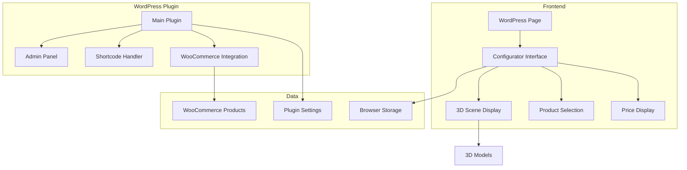

# Design Document

## Overview

The Blasti.shop 3D Configurator is a WordPress plugin that provides a 3D interface for customers to design pegboards with accessories. The system integrates with WooCommerce to handle product data and cart functionality. The design focuses on simplicity, reliability, and good performance across desktop and mobile devices.

## Architecture

### System Architecture



### Plugin Structure

```
blasti-configurator/
├── blasti-configurator.php (main plugin file)
├── includes/
│   ├── class-main.php
│   ├── class-admin.php
│   ├── class-shortcode.php
│   └── class-woocommerce.php
├── assets/
│   ├── js/
│   │   ├── configurator.js
│   │   ├── three.min.js
│   │   └── admin.js
│   ├── css/
│   │   ├── configurator.css
│   │   └── admin.css
│   └── models/
│       └── (3D model files)
├── templates/
│   ├── configurator.php
│   └── admin-page.php
└── languages/
    └── (translation files)
```

## Components and Interfaces

### Backend Components

#### 1. Main Plugin Class
**Purpose:** Core plugin functionality and initialization

```php
class Blasti_Configurator_Main {
    public function __construct() {
        add_action('init', array($this, 'init'));
        add_action('wp_enqueue_scripts', array($this, 'enqueue_scripts'));
    }
    
    public function init() {
        // Initialize plugin components
        // Register shortcodes
        // Setup WooCommerce integration
    }
    
    public function enqueue_scripts() {
        // Load Three.js and configurator scripts
        // Load CSS styles
    }
}
```

#### 2. Admin Class
**Purpose:** WordPress admin interface for managing products and settings

```php
class Blasti_Configurator_Admin {
    public function __construct() {
        add_action('admin_menu', array($this, 'add_admin_menu'));
        add_action('admin_init', array($this, 'register_settings'));
    }
    
    public function add_admin_menu() {
        // Add admin menu pages
    }
    
    public function manage_products() {
        // Interface for managing pegboards and accessories
        // Upload 3D models
        // Set product compatibility
    }
}
```

#### 3. WooCommerce Integration
**Purpose:** Connect with WooCommerce products and cart

```php
class Blasti_Configurator_WooCommerce {
    public function get_products($type = 'all') {
        // Get pegboards and accessories from WooCommerce
        // Return product data with 3D model info
    }
    
    public function add_to_cart($configuration) {
        // Add pegboard and accessories to WooCommerce cart
        // Handle quantities and pricing
    }
    
    public function get_product_price($product_id) {
        // Get current WooCommerce price
    }
}
```

### Frontend Components

#### 1. Configurator Interface
**Purpose:** Main user interface for the 3D configurator

```javascript
class ConfiguratorApp {
    constructor(container) {
        this.container = container;
        this.scene = new SceneManager();
        this.products = new ProductManager();
        this.cart = new CartManager();
        
        this.init();
    }
    
    init() {
        // Setup 3D scene
        // Load product data
        // Setup event listeners
        // Initialize mobile support
    }
    
    render() {
        // Render 3D scene
        // Update UI elements
        // Handle user interactions
    }
}
```

#### 2. Scene Manager
**Purpose:** Handle 3D rendering and interactions

```javascript
class SceneManager {
    constructor() {
        this.scene = new THREE.Scene();
        this.camera = new THREE.PerspectiveCamera();
        this.renderer = new THREE.WebGLRenderer();
        this.controls = new THREE.OrbitControls(this.camera, this.renderer.domElement);
    }
    
    loadPegboard(pegboardData) {
        // Load pegboard 3D model
        // Position in scene
        // Setup grid system
    }
    
    addAccessory(accessory, position) {
        // Load accessory 3D model
        // Place at position
        // Snap to grid
    }
    
    removeAccessory(accessoryId) {
        // Remove from scene
        // Update configuration
    }
}
```

#### 3. Product Manager
**Purpose:** Handle product data and selection

```javascript
class ProductManager {
    constructor() {
        this.pegboards = [];
        this.accessories = [];
        this.currentPegboard = null;
    }
    
    async loadProducts() {
        // Fetch products from WordPress
        // Organize by type
        // Cache for performance
    }
    
    selectPegboard(pegboardId) {
        // Set current pegboard
        // Update 3D scene
        // Filter compatible accessories
    }
    
    getCompatibleAccessories(pegboardId) {
        // Return accessories that work with pegboard
    }
}
```

## Data Models

### Product Models

```javascript
class Product {
    constructor(data) {
        this.id = data.id;
        this.name = data.name;
        this.price = data.price;
        this.modelUrl = data.modelUrl;
        this.type = data.type; // 'pegboard' or 'accessory'
        this.dimensions = data.dimensions;
        this.compatibility = data.compatibility || [];
        this.inStock = data.inStock;
    }
    
    isCompatibleWith(productId) {
        return this.compatibility.includes(productId);
    }
}

class Configuration {
    constructor() {
        this.id = this.generateId();
        this.pegboard = null;
        this.accessories = [];
        this.totalPrice = 0;
        this.createdAt = new Date();
    }
    
    setPegboard(pegboard) {
        this.pegboard = pegboard;
        this.updateTotalPrice();
    }
    
    addAccessory(accessory, position) {
        const placement = {
            id: this.generateId(),
            accessory: accessory,
            position: position,
            addedAt: new Date()
        };
        
        this.accessories.push(placement);
        this.updateTotalPrice();
        
        return placement.id;
    }
    
    removeAccessory(placementId) {
        this.accessories = this.accessories.filter(a => a.id !== placementId);
        this.updateTotalPrice();
    }
    
    updateTotalPrice() {
        this.totalPrice = 0;
        
        if (this.pegboard) {
            this.totalPrice += this.pegboard.price;
        }
        
        this.accessories.forEach(placement => {
            this.totalPrice += placement.accessory.price;
        });
    }
    
    generateId() {
        return Date.now().toString(36) + Math.random().toString(36).substr(2);
    }
    
    toCartData() {
        const items = [];
        
        if (this.pegboard) {
            items.push({
                product_id: this.pegboard.id,
                quantity: 1
            });
        }
        
        this.accessories.forEach(placement => {
            items.push({
                product_id: placement.accessory.id,
                quantity: 1
            });
        });
        
        return items;
    }
}
```

## Key Features Implementation

### 1. Dynamic Price Calculator

```javascript
class PriceCalculator {
    constructor(woocommerceApi) {
        this.woocommerceApi = woocommerceApi;
        this.currentConfiguration = null;
        this.priceDisplay = document.getElementById('price-display');
        this.addToCartButton = document.getElementById('add-to-cart-btn');
    }
    
    updatePrice(configuration) {
        this.currentConfiguration = configuration;
        let totalPrice = 0;
        
        // Add pegboard price
        if (configuration.pegboard) {
            totalPrice += parseFloat(configuration.pegboard.price);
        }
        
        // Add accessory prices
        configuration.accessories.forEach(placement => {
            totalPrice += parseFloat(placement.accessory.price);
        });
        
        // Update display with animation
        this.animatePriceChange(totalPrice);
        
        // Enable/disable add to cart button
        this.addToCartButton.disabled = !configuration.pegboard;
    }
    
    animatePriceChange(newPrice) {
        const formattedPrice = '$' + newPrice.toFixed(2);
        
        // Add animation class
        this.priceDisplay.classList.add('price-updating');
        
        setTimeout(() => {
            this.priceDisplay.textContent = formattedPrice;
            this.priceDisplay.classList.remove('price-updating');
        }, 200);
    }
    
    async addToCart() {
        if (!this.currentConfiguration.pegboard) {
            alert('Please select a pegboard first');
            return;
        }
        
        try {
            // Prepare cart data
            const cartItems = this.currentConfiguration.toCartData();
            
            // Add to WooCommerce cart
            const response = await this.woocommerceApi.addToCart(cartItems);
            
            if (response.success) {
                // Redirect to cart page
                window.location.href = response.cart_url;
            } else {
                throw new Error(response.message);
            }
        } catch (error) {
            alert('Failed to add items to cart. Please try again.');
            console.error('Cart error:', error);
        }
    }
}
```

### 2. Camera Angle System

```javascript
class CameraManager {
    constructor(camera, controls) {
        this.camera = camera;
        this.controls = controls;
        this.presetAngles = {
            'front': { position: [0, 2, 8], target: [0, 1, 0] },
            'side': { position: [8, 2, 0], target: [0, 1, 0] },
            'top': { position: [0, 10, 2], target: [0, 0, 0] },
            'angle': { position: [6, 4, 6], target: [0, 1, 0] },
            'close': { position: [0, 1, 3], target: [0, 1, 0] }
        };
        this.currentAngle = 'angle';
        
        this.setupCameraControls();
    }
    
    setupCameraControls() {
        // Create camera angle buttons
        const cameraControls = document.getElementById('camera-controls');
        
        Object.keys(this.presetAngles).forEach(angleName => {
            const button = document.createElement('button');
            button.textContent = angleName.charAt(0).toUpperCase() + angleName.slice(1);
            button.className = 'camera-angle-btn';
            button.onclick = () => this.setAngle(angleName);
            cameraControls.appendChild(button);
        });
        
        // Set initial angle
        this.setAngle('angle');
    }
    
    setAngle(angleName) {
        if (!this.presetAngles[angleName]) return;
        
        const preset = this.presetAngles[angleName];
        this.currentAngle = angleName;
        
        // Animate camera movement
        this.animateToPosition(preset.position, preset.target);
        
        // Update active button
        document.querySelectorAll('.camera-angle-btn').forEach(btn => {
            btn.classList.remove('active');
        });
        event.target.classList.add('active');
    }
    
    animateToPosition(targetPosition, targetLookAt) {
        const startPosition = this.camera.position.clone();
        const startTarget = this.controls.target.clone();
        
        const endPosition = new THREE.Vector3(...targetPosition);
        const endTarget = new THREE.Vector3(...targetLookAt);
        
        let progress = 0;
        const duration = 1000; // 1 second
        const startTime = Date.now();
        
        const animate = () => {
            const elapsed = Date.now() - startTime;
            progress = Math.min(elapsed / duration, 1);
            
            // Smooth easing function
            const eased = this.easeInOutCubic(progress);
            
            // Interpolate position
            this.camera.position.lerpVectors(startPosition, endPosition, eased);
            this.controls.target.lerpVectors(startTarget, endTarget, eased);
            
            this.controls.update();
            
            if (progress < 1) {
                requestAnimationFrame(animate);
            }
        };
        
        animate();
    }
    
    easeInOutCubic(t) {
        return t < 0.5 ? 4 * t * t * t : (t - 1) * (2 * t - 2) * (2 * t - 2) + 1;
    }
}
```

### 3. Live Configuration Updates

```javascript
class ConfigurationManager {
    constructor(sceneManager, priceCalculator, cameraManager) {
        this.sceneManager = sceneManager;
        this.priceCalculator = priceCalculator;
        this.cameraManager = cameraManager;
        this.configuration = new Configuration();
        
        this.setupEventListeners();
    }
    
    setupEventListeners() {
        // Pegboard selection
        document.addEventListener('pegboard-selected', (event) => {
            this.selectPegboard(event.detail.pegboard);
        });
        
        // Accessory addition
        document.addEventListener('accessory-add', (event) => {
            this.addAccessory(event.detail.accessory, event.detail.position);
        });
        
        // Accessory removal
        document.addEventListener('accessory-remove', (event) => {
            this.removeAccessory(event.detail.placementId);
        });
    }
    
    selectPegboard(pegboard) {
        // Update configuration
        this.configuration.setPegboard(pegboard);
        
        // Update 3D scene
        this.sceneManager.loadPegboard(pegboard);
        
        // Update price display
        this.priceCalculator.updatePrice(this.configuration);
        
        // Show compatible accessories
        this.showCompatibleAccessories(pegboard);
        
        // Animate to good viewing angle
        this.cameraManager.setAngle('angle');
    }
    
    addAccessory(accessory, position) {
        // Validate placement
        if (!this.sceneManager.gridSystem.isValidPosition(position, accessory.dimensions)) {
            alert('Cannot place accessory at this position');
            return;
        }
        
        // Add to configuration
        const placementId = this.configuration.addAccessory(accessory, position);
        
        // Update 3D scene
        this.sceneManager.addAccessory(accessory, position, placementId);
        
        // Update price display with animation
        this.priceCalculator.updatePrice(this.configuration);
        
        // Update accessory list UI
        this.updateAccessoryList();
    }
    
    removeAccessory(placementId) {
        // Find placement in configuration
        const placement = this.configuration.accessories.find(a => a.id === placementId);
        if (!placement) return;
        
        // Remove from configuration
        this.configuration.removeAccessory(placementId);
        
        // Update 3D scene
        this.sceneManager.removeAccessory(placementId);
        
        // Update price display
        this.priceCalculator.updatePrice(this.configuration);
        
        // Update accessory list UI
        this.updateAccessoryList();
    }
    
    showCompatibleAccessories(pegboard) {
        const accessoryList = document.getElementById('accessory-list');
        accessoryList.innerHTML = '';
        
        // Filter accessories compatible with selected pegboard
        const compatibleAccessories = this.getCompatibleAccessories(pegboard);
        
        compatibleAccessories.forEach(accessory => {
            const accessoryElement = this.createAccessoryElement(accessory);
            accessoryList.appendChild(accessoryElement);
        });
    }
    
    updateAccessoryList() {
        const placedList = document.getElementById('placed-accessories');
        placedList.innerHTML = '';
        
        this.configuration.accessories.forEach(placement => {
            const item = document.createElement('div');
            item.className = 'placed-accessory-item';
            item.innerHTML = `
                <span>${placement.accessory.name}</span>
                <span>$${placement.accessory.price}</span>
                <button onclick="this.removeAccessory('${placement.id}')">Remove</button>
            `;
            placedList.appendChild(item);
        });
    }
}
```

### 4. 3D Scene Management

```javascript
class SceneManager {
    constructor(container) {
        this.container = container;
        this.scene = new THREE.Scene();
        this.camera = new THREE.PerspectiveCamera(75, window.innerWidth / window.innerHeight, 0.1, 1000);
        this.renderer = new THREE.WebGLRenderer({ antialias: true });
        this.controls = new THREE.OrbitControls(this.camera, this.renderer.domElement);
        
        this.init();
    }
    
    init() {
        // Setup renderer
        this.renderer.setSize(this.container.clientWidth, this.container.clientHeight);
        this.renderer.shadowMap.enabled = true;
        this.container.appendChild(this.renderer.domElement);
        
        // Setup lighting
        const ambientLight = new THREE.AmbientLight(0x404040, 0.6);
        const directionalLight = new THREE.DirectionalLight(0xffffff, 0.8);
        directionalLight.position.set(10, 10, 5);
        directionalLight.castShadow = true;
        
        this.scene.add(ambientLight);
        this.scene.add(directionalLight);
        
        // Position camera
        this.camera.position.set(0, 5, 10);
        this.controls.target.set(0, 0, 0);
        
        // Start render loop
        this.animate();
    }
    
    animate() {
        requestAnimationFrame(() => this.animate());
        this.controls.update();
        this.renderer.render(this.scene, this.camera);
    }
    
    loadModel(url) {
        const loader = new THREE.GLTFLoader();
        return new Promise((resolve, reject) => {
            loader.load(url, resolve, undefined, reject);
        });
    }
}
```

### 2. Grid System for Accessory Placement

```javascript
class GridSystem {
    constructor(pegboardDimensions) {
        this.width = pegboardDimensions.width;
        this.height = pegboardDimensions.height;
        this.gridSize = 0.1; // 10cm grid
        this.occupiedPositions = new Set();
    }
    
    snapToGrid(position) {
        return {
            x: Math.round(position.x / this.gridSize) * this.gridSize,
            y: Math.round(position.y / this.gridSize) * this.gridSize,
            z: position.z
        };
    }
    
    isValidPosition(position, accessorySize) {
        const snappedPos = this.snapToGrid(position);
        
        // Check bounds
        if (snappedPos.x < 0 || snappedPos.x + accessorySize.width > this.width ||
            snappedPos.y < 0 || snappedPos.y + accessorySize.height > this.height) {
            return false;
        }
        
        // Check for overlaps
        for (let x = snappedPos.x; x < snappedPos.x + accessorySize.width; x += this.gridSize) {
            for (let y = snappedPos.y; y < snappedPos.y + accessorySize.height; y += this.gridSize) {
                const key = `${x},${y}`;
                if (this.occupiedPositions.has(key)) {
                    return false;
                }
            }
        }
        
        return true;
    }
    
    occupyPosition(position, accessorySize) {
        const snappedPos = this.snapToGrid(position);
        
        for (let x = snappedPos.x; x < snappedPos.x + accessorySize.width; x += this.gridSize) {
            for (let y = snappedPos.y; y < snappedPos.y + accessorySize.height; y += this.gridSize) {
                const key = `${x},${y}`;
                this.occupiedPositions.add(key);
            }
        }
    }
    
    freePosition(position, accessorySize) {
        const snappedPos = this.snapToGrid(position);
        
        for (let x = snappedPos.x; x < snappedPos.x + accessorySize.width; x += this.gridSize) {
            for (let y = snappedPos.y; y < snappedPos.y + accessorySize.height; y += this.gridSize) {
                const key = `${x},${y}`;
                this.occupiedPositions.delete(key);
            }
        }
    }
}
```

### 3. Mobile Touch Support

```javascript
class TouchHandler {
    constructor(renderer, camera, controls) {
        this.renderer = renderer;
        this.camera = camera;
        this.controls = controls;
        this.isMobile = this.detectMobile();
        
        if (this.isMobile) {
            this.setupMobileControls();
        }
    }
    
    detectMobile() {
        return /Android|webOS|iPhone|iPad|iPod|BlackBerry|IEMobile|Opera Mini/i.test(navigator.userAgent);
    }
    
    setupMobileControls() {
        // Adjust controls for mobile
        this.controls.enableDamping = true;
        this.controls.dampingFactor = 0.1;
        this.controls.rotateSpeed = 0.5;
        this.controls.zoomSpeed = 0.8;
        this.controls.panSpeed = 0.8;
        
        // Add touch event listeners
        this.renderer.domElement.addEventListener('touchstart', this.onTouchStart.bind(this));
        this.renderer.domElement.addEventListener('touchmove', this.onTouchMove.bind(this));
        this.renderer.domElement.addEventListener('touchend', this.onTouchEnd.bind(this));
    }
    
    onTouchStart(event) {
        if (event.touches.length === 1) {
            // Single touch - prepare for tap or drag
            this.touchStart = {
                x: event.touches[0].clientX,
                y: event.touches[0].clientY,
                time: Date.now()
            };
        }
    }
    
    onTouchMove(event) {
        // Handle during touch move if needed
    }
    
    onTouchEnd(event) {
        if (this.touchStart && event.changedTouches.length === 1) {
            const touchEnd = {
                x: event.changedTouches[0].clientX,
                y: event.changedTouches[0].clientY,
                time: Date.now()
            };
            
            // Check if it's a tap (short duration, small movement)
            const duration = touchEnd.time - this.touchStart.time;
            const distance = Math.sqrt(
                Math.pow(touchEnd.x - this.touchStart.x, 2) + 
                Math.pow(touchEnd.y - this.touchStart.y, 2)
            );
            
            if (duration < 300 && distance < 10) {
                this.handleTap(touchEnd);
            }
        }
        
        this.touchStart = null;
    }
    
    handleTap(position) {
        // Convert screen coordinates to 3D world coordinates
        // Check for intersections with pegboard
        // Trigger accessory placement if appropriate
    }
}
```

## Error Handling

### Basic Error Management

```javascript
class ErrorHandler {
    constructor() {
        this.errors = [];
    }
    
    handleError(error, context = {}) {
        console.error('Configurator Error:', error, context);
        
        // Log error
        this.errors.push({
            error: error,
            context: context,
            timestamp: new Date()
        });
        
        // Handle specific error types
        switch (error.type) {
            case 'MODEL_LOAD_FAILED':
                this.showMessage('Failed to load 3D model. Please try again.');
                break;
            case 'NETWORK_ERROR':
                this.showMessage('Network error. Please check your connection.');
                break;
            case 'CART_ERROR':
                this.showMessage('Failed to add items to cart. Please try again.');
                break;
            default:
                this.showMessage('An error occurred. Please refresh the page.');
        }
    }
    
    showMessage(message) {
        // Display user-friendly error message
        const errorDiv = document.createElement('div');
        errorDiv.className = 'configurator-error';
        errorDiv.textContent = message;
        
        document.body.appendChild(errorDiv);
        
        // Remove after 5 seconds
        setTimeout(() => {
            if (errorDiv.parentNode) {
                errorDiv.parentNode.removeChild(errorDiv);
            }
        }, 5000);
    }
}
```

## Testing Strategy

### Basic Testing Approach

**Manual Testing:**
- Test configurator loading on different devices
- Verify pegboard and accessory selection works
- Test 3D scene interactions (zoom, rotate, pan)
- Verify cart integration with WooCommerce
- Test mobile touch interactions
- Check price calculations are correct

**Browser Testing:**
- Chrome, Firefox, Safari, Edge
- Mobile browsers (iOS Safari, Chrome Mobile)
- Test on different screen sizes

**Performance Testing:**
- Monitor 3D scene frame rate
- Test with multiple accessories placed
- Check memory usage during extended use
- Verify 3D models load within reasonable time

**Integration Testing:**
- Test WooCommerce product data loading
- Verify cart addition functionality
- Test with different WooCommerce configurations
- Check WordPress theme compatibility

## Security Considerations

### Basic Security Measures

**WordPress Security:**
- Follow WordPress coding standards
- Use WordPress nonces for form submissions
- Sanitize all user inputs
- Validate data before processing
- Use WordPress user capabilities for admin access

**Data Handling:**
- Store configuration data in browser localStorage only
- Don't store sensitive user information
- Use HTTPS for all communications
- Validate product IDs before cart operations

**File Security:**
- Restrict 3D model uploads to admin users only
- Validate file types (only allow GLB/GLTF)
- Store uploaded files in secure directory
- Implement file size limits

```php
// Example security validation
public function sanitize_configuration_data($data) {
    $sanitized = array();
    
    if (isset($data['pegboard_id'])) {
        $sanitized['pegboard_id'] = absint($data['pegboard_id']);
    }
    
    if (isset($data['accessories']) && is_array($data['accessories'])) {
        $sanitized['accessories'] = array();
        foreach ($data['accessories'] as $accessory) {
            if (isset($accessory['id']) && isset($accessory['position'])) {
                $sanitized['accessories'][] = array(
                    'id' => absint($accessory['id']),
                    'position' => array(
                        'x' => floatval($accessory['position']['x']),
                        'y' => floatval($accessory['position']['y']),
                        'z' => floatval($accessory['position']['z'])
                    )
                );
            }
        }
    }
    
    return $sanitized;
}
```

This simplified design focuses on core functionality that can be implemented reliably while maintaining good performance and user experience.